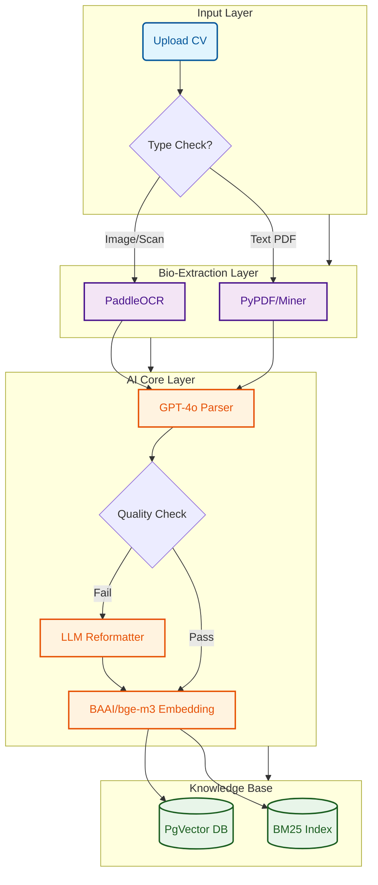
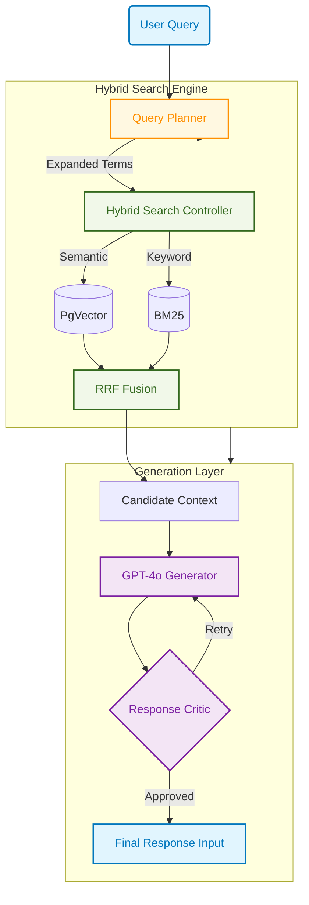

# Smart CV Screening & Matching System

Comprehensive AI-powered system for intelligent Recruitment that automates CV parsing, screening, and matching. Built with advanced RAG (Retrieval-Augmented Generation) and Agentic Workflow.


## Key Features

### Intelligent Parsing & Screening
- **Multi-Modal Ingestion**: Handles PDFs, Images, and scanned documents using **PaddleOCR**.
- **Vietnamese NLP**: Specialized support for Vietnamese CVs using **Underthesea** for word segmentation.
- **LLM-Powered Extraction**: Uses **GPT-4o** with Structured Outputs to extract entities (Education, Experience, Skills) with high precision.
- **Auto-Correction**: **LLM Evaluator** checks extracted data quality and auto-reformats inconsistencies.

### Advanced Search & Matching
- **Hybrid Search**: Combines **BM25** (keyword) and **Vector Search** (semantic) using **Reciprocal Rank Fusion (RRF)**.
- **Semantic Understanding**: Uses `BAAI/bge-m3` embedding model for deep understanding of technical skills and job descriptions.
- **Smart Matching**: Auto-calculates years of experience (handling overlapping timelines) and matches candidates to JD.

### Batch Processing & Integration
- **Batch Import**: Scan and process entire directories of CVs in one click.
- **Google Drive Integration**: Import CVs directly from public Google Drive folders.
- **Concurrency Control**: Optimized for stability with managed Celery workers (configurable concurrency).

### RAG Chat Assistant
- **Context-Aware Chat**: Chat with your candidate database. Ask questions like *"Who knows Python and has >3 years exp?"*.
- **Grounded Responses**: Answers are strictly based on CV data, cited with sources.
- **Zero-Latency Response**: Optimized streaming pipeline for instant feedback.

---

## System Architecture

### Processing Pipeline (Ingestion)
The system transforms raw unstructured data into a structured knowledge base using a multi-stage AI pipeline.



**Workflow Technologies:**
*   **Input**: Auto-sensing file type detection.
*   **OCR Engine**: `PaddleOCR` (Optimized for Vietnamese/English).
*   **Parsing Engine**: `OpenAI GPT-4o` (Structured Output Mode).
*   **Embedding Model**: `BAAI/bge-m3` (Multi-lingual, 1024 dim).
*   **Database**: `PostgreSQL 16` + `pgvector` extension.

### RAG Chat Pipeline (Retrieval & Generation)
An Agentic RAG workflow delivering grounded, accurate answers.



**Pipeline Technologies:**
*   **Query Expansion**: `GPT-4o` rephrases queries for better recall.
*   **Hybrid Search**:
    *   **Semantic**: Cosine Similarity via `pgvector`.
    *   **Keyword**: `BM25` algorithm for exact matches.
    *   **Fusion**: Reciprocal Rank Fusion (**RRF**) algorithm.
*   **Generation**: `GPT-4o` with strict context grounding.
*   **Quality Control**: Secondary LLM "Critic" evaluates answer accuracy before display.

---

## Installation & Setup

### Prerequisites
- **Docker & Docker Compose**
- **Python 3.11+** (for local scripts)
- **Node.js 18+** (for frontend development)
- **OpenAI API Key**

### Quick Start (Recommended)

1. **Clone the repository**:
   ```bash
   git clone <repo-url>
   cd smart-cv-screening
   ```

2. **Configure Environment**:
   ```bash
   cp .env.example .env
   # Open .env and add your OPENAI_API_KEY
   ```

3. **Start the System**:
   You can run the project directly with Docker (Recommended):

   ```bash
   # Option A: Quick Start script
   ./start_project.sh

   # Option B: Manual Docker Command
   # Build and start services (First time may take 5-10 mins to download AI models)
   docker-compose up --build -d
   ```

   *The system will be available at:*
   - **Frontend**: [http://localhost:3000](http://localhost:3000)
   - **Backend API**: [http://localhost:8000](http://localhost:8000)
   - **API Docs**: [http://localhost:8000/docs](http://localhost:8000/docs)
   - **Flower (Worker Monitor)**: [http://localhost:5555](http://localhost:5555)

4. **Common Docker Commands**:
   ```bash
   # View logs (real-time)
   docker-compose logs -f

   # Stop all services
   docker-compose down

   # Stop and remove volumes (Caution: Deletes DB data)
   docker-compose down -v
   ```

5. **Stop the System**:
   ```bash
   ./stop_project.sh
   # OR
   docker-compose down
   ```

---

## Usage Guide

### 1. Uploading CVs
- **Single Upload**: Drag & drop a file on the Chat Interface.
- **Batch Import**: 
  - Click the **"Batch Import"** button in the header.
  - **Local Folder**: Enter server path (e.g., `./public_cvs`).
  - **Google Drive**: Paste a public folder link (e.g., `https://drive.google.com/...`).

### 2. Chatting & Searching
- Type natural language queries:
  - *"Find Java developers with Spring Boot experience."*
  - *"Compare Candidate A and Candidate B."*
  - *"Who is the best fit for a Senior Frontend role?"*

### 3. CLI Tools
The project includes helpful CLI scripts:
- `python3 list_db.py`: View all candidates in the database.
- `python3 scan_cvs.py <directory>`: Trigger batch processing from CLI.
- `python3 clear_db.py`: **(Caution)** Wipe the database.

---

## Project Structure

```text
smart-cv-screening/
├── app/                    # Backend Source Code
│   ├── api/                # FastAPI Routes
│   ├── core/               # Config & Celery
│   ├── models/             # Database Models
│   ├── schemas/            # Pydantic Schemas
│   ├── services/           # Core Logic
│   │   ├── ingestion/      # OCR & Preprocessing
│   │   ├── parsing/        # LLM Parsing & Evaluation
│   │   ├── embedding/      # Vector Generation
│   │   ├── search/         # Search Engines
│   │   └── chat/           # RAG Pipeline
│   └── workers/            # Background Tasks
├── frontend/               # Next.js Frontend
│   ├── app/                # Pages & Layouts
│   ├── components/         # UI Components
│   └── lib/                # API Clients
├── scripts/                # Utility Scripts
├── .env.example            # Environment Template
├── docker-compose.yml      # Infrastructure
├── requirements.txt        # Python Dependencies
├── start_project.sh        # Startup Script
└── stop_project.sh         # Shutdown Script
```

## Contribution

1. Fork the Project
2. Create your Feature Branch (`git checkout -b feature/AmazingFeature`)
3. Commit your Changes (`git commit -m 'Add some AmazingFeature'`)
4. Push to the Branch (`git push origin feature/AmazingFeature`)
5. Open a Pull Request

